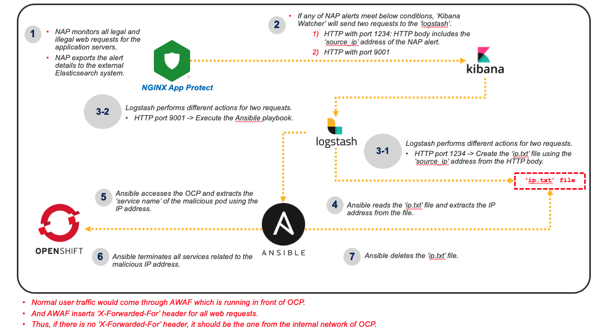

# Automated Remediation of Unauthorized POD in OpenShift environment

## Summary
In a typical data center security design, advanced application security solutions are deployed at the edge of a Kubernetes or OpenShift environment. 
With F5 CIS integration, edge WAF could get a certain level of visibility for the specific pod inside Kubernetes or OpenShift cluster. 
But it is still can not stop the attack within the cluster.  To overcome this challenge, 'NAP(NGINX App Protect)' could be deployed as a POD or service proxy in Kubernetes or OpenShift cluster. 
The NAP(NGINX App Protect) delivers Layer 7 visibility and granular control for the applications while enabling the advanced level of the application security policies. 
With NAP deployment, DevSecOps can ensure only legitimate traffic allowed while all other unwanted traffics blocked. 
The NAP can monitor the traffic traversing namespace boundaries between pods and provide the advanced application protection at the layer-7 level for East-West traffic. 

## Prerequisites
- ELK(Elasticsearch, Logstash, Kibana) installed (required Platinum or Trial license)
- Ansible installed on the same server with ELK
- Evaluation license of NAP(NGINX App Protect)
- You can reqeust the evaluation license of NGINX App Protect in [here](https://www.nginx.com/free-trial-request/).
- Minimum 1 x OCP cluster installed.
- You have to prepare two laptops - one for OCP admin console, one for dev_user console(infected machine)

## Use-Case Scenario
1. The malware of 'Phishing email' infects the developer's laptop. 
2. Attacker steals the ID/PW of the developer using the malware. In this demo, the stolen ID is 'dev_user.' 
3. Attacker login the 'Test App' on the 'dev-test01' namespace, which is owned by the 'dev_user'. 
4. Attacker starts the network-scanning on the internal subnet of the OpenShift cluster. And the attacker finds the 'critical-app' application.
5. Attacker starts the web-based attack against 'critical-app'. 
6. The 'critical-app' is protected by NGINX App Protect; thus, the attack traffic is blocked by NGINX immediately. 
7. NGINX exports the alert details to the external Elasticsearch.
8. If this specific alert meets the pre-defined condition, Elasticsearch will trigger the pre-defined Ansible playbook. 
9. Ansible playbook access to OpenShift and delete the malicious 'POD" automatically. 

*Since this demo focuses on the attack inside the OpenShift cluster, the demo does not include the 'Step#1' and 'Step#2'(Phishing email part).*

## Security Automation Process

## Setup and Configuration
Follow the links below in order to begin setup and configuration.

1. [Prepare the 'NGINX App Protect' container image](https://github.com/network1211/f5-security-automation-ansible/blob/master/devsecops/malicious_pod/nap_create/README.md)
2. [Install demo applications, and NGINX App Protect on the OpenShift](https://github.com/network1211/f5-security-automation-ansible/blob/master/devsecops/malicious_pod/install_app/README.md)
3. [Create the Ansible Playbook](https://github.com/network1211/f5-security-automation-ansible/blob/master/devsecops/malicious_pod/create_ansible/README.md)
4. [Configuring the 'Watcher' and 'Logstash' of Elasticsearch](https://github.com/network1211/f5-security-automation-ansible/blob/master/devsecops/malicious_pod/elk_config/README.md)
5. Verify the demo
