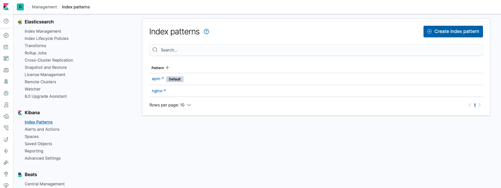
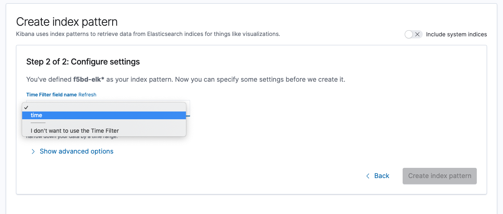
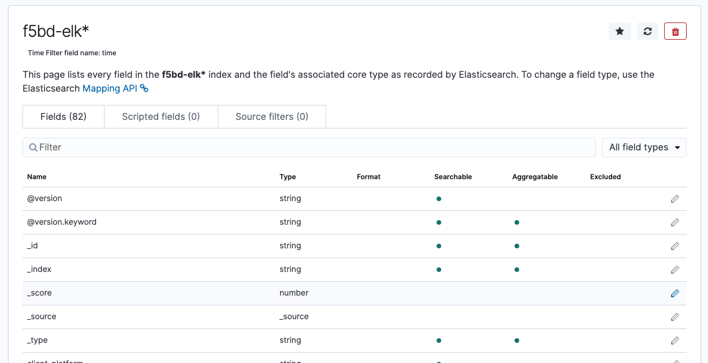
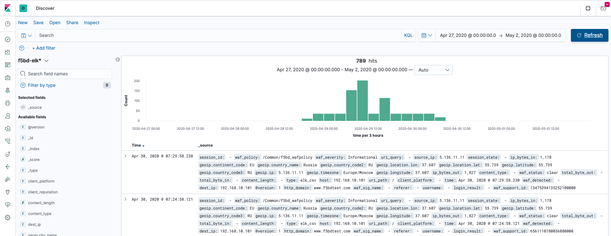

# Importing sample CSV files to your Kibana

## Configuration Step
### *Please make sure that your Logstash already includes 'Geo-plugin.'* 
### *You should download the 'GeoLite2-City.mmdb' file in your logstash server before proceeding with this step. You can download it from the Maxmind website.(https://www.maxmind.com/en/geoip2-country-database)* 

1. Creating Logstash Conf file to import CSV file
```
logstash_csv.conf

input {
    file {
        path => "/your_file_path/f5bd-sample-elk-2.csv"
        start_position => "beginning"
        sincedb_path => "/dev/null"
	}
}

filter {
        csv {
          columns => [ "time", "client_platform", "client_reputation", "content_length", "content_type", "dest_ip", "host", "http_domain", "ip_byte
s_in", "ip_bytes_out", "login_result", "referer", "session_id", "session_state", "source_ip", "total_byte_in", "total_byte_out", "uri_path", "uri_q
uery", "username", "waf_detected", "waf_policy", "waf_severity", "waf_sig_name", "waf_status", "waf_support_id" ]
        }

        geoip {
          source => "source_ip"
          database => "/etc/logstash/GeoLite2-City.mmdb"
        }

	date {
          match => [ "time" , "yyyy-MM-dd'T'HH:mm:ss.SSS" ]
        }

	mutate {
		remove_field => ["message", "path", "@timestamp"]
		convert => ["ip_bytes_in", "integer"]
		convert => ["ip_bytes_out", "integer"]
		convert => ["total_byte_in", "integer"]
		convert => ["total_byte_out", "integer"]
		convert => ["content_length", "integer"]
	}
}

output {
         elasticsearch {
                hosts => ["127.0.0.1:9200"]
                index => "f5bd-elk"
        }
}
```

2. Configuring Index Pattern 
- *Go to Kibana, 'Management' -> 'Index pattern'*





3. Verifying imported data
- *Go to Kibana, 'Discover' -> Set time range from '27th Apr 2020 @ 00:00:00' to '2nd May 2020 @ 00:00:00'. -> Click 'Refresh'*



